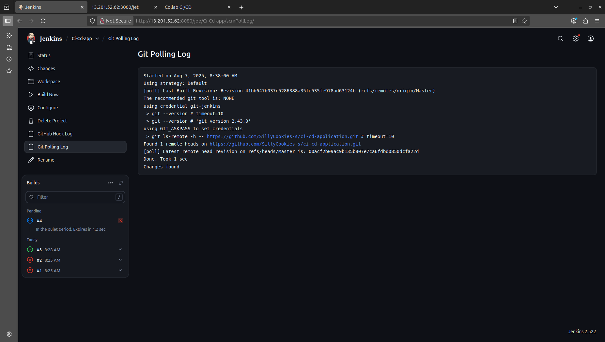

# AWS Deployment Guide

## 🚀 Deployment Options

### Option 1: Terraform (Automated)
Complete infrastructure setup with Jenkins & Docker pre-installed.

### Option 2: Existing EC2
Deploy on your existing EC2 instance with manual setup.

## 🏗️ Option 1: Terraform Deployment

### Prerequisites
- AWS Account with programmatic access
- Terraform installed
- SSH key pair in AWS

### Steps

1. **Clone Repository**
   ```bash
   git clone https://github.com/SillyCookies-s/devops-automation-pipeline.git
   cd devops-automation-pipeline/terraform
   ```

2. **⚠️ Setup Your AWS Credentials**
   ```bash
   # Copy example file and update with your credentials
   cp variable_example.tf variable.tf
   nano variable.tf
   ```
   
   **Replace these values:**
   - `YOUR_AWS_ACCESS_KEY_ID` → Your AWS Access Key
   - `YOUR_AWS_SECRET_ACCESS_KEY` → Your AWS Secret Key
   - `subnet-xxxxxxxxxxxxxxxxx` → Your subnet ID
   - `vpc-xxxxxxxxxxxxxxxxx` → Your VPC ID
   - `your-key-pair-name` → Your EC2 key pair

3. **Deploy Infrastructure**
   ```bash
   terraform init  # Auto-generates .terraform/ and .terraform.lock.hcl
   terraform plan  # Auto-generates plan files
   terraform apply # Auto-generates .tfstate files
   ```
   
   **Note**: `.tfstate`, `.tfvars`, and plan files are automatically generated by Terraform commands and should not be manually edited.

4. **Wait 10-15 minutes** for installation

5. **Access Jenkins**
   ```bash
   # Get EC2 IP
   terraform output instance_public_ip
   
   # Access: http://<EC2_IP>:8080
   # Password: sudo cat /var/lib/jenkins/secrets/initialAdminPassword
   ```
   
   
   *EC2 instance with matching IP address*

### Jenkins Job Setup

*Jenkins polling log showing Git change detection*

1. **New Item** → **Freestyle Project**
2. **Git**: `https://github.com/SillyCookies-s/devops-automation-pipeline.git`
3. **Poll SCM**: `* * * * *`
4. **Build Steps**:
   ```bash
   cd application  # Source: https://github.com/SillyCookies-s/devops-automation-pipeline/tree/main/application
   docker compose down || true
   docker compose up --build -d
   ```
   
   
   *Console output of successful deployment*

### Verify Deployment
- Frontend: `http://<EC2_IP>:5000`
- Backend: `http://<EC2_IP>:3000`
- API: `http://<EC2_IP>:3000/jet`


*Frontend running at `<ec2-ip>:5000`*


*Backend API at `<ec2-ip>:3000/jet`*

## 💻 Option 2: Existing EC2 Deployment

### Manual Setup
1. **Install Docker**
   ```bash
   sudo yum update -y
   sudo yum install -y docker
   sudo systemctl start docker
   sudo usermod -aG docker ec2-user
   ```

2. **Install Jenkins**
   ```bash
   sudo yum install -y java-11-openjdk
   sudo wget -O /etc/yum.repos.d/jenkins.repo https://pkg.jenkins.io/redhat-stable/jenkins.repo
   sudo rpm --import https://pkg.jenkins.io/redhat-stable/jenkins.io.key
   sudo yum install -y jenkins
   sudo systemctl start jenkins
   sudo usermod -aG docker jenkins
   ```

3. **Configure Security Groups**
   - Port 22 (SSH)
   - Port 8080 (Jenkins)
   - Port 5000 (Frontend)
   - Port 3000 (Backend)

4. **Setup Jenkins Job** (same as Option 1)

## 🛠️ Troubleshooting

### Common Issues
- **Jenkins not starting**: `sudo systemctl restart jenkins`
- **Docker permissions**: `sudo usermod -aG docker jenkins`
- **Container issues**: `docker compose logs`

### Verification Commands
```bash
sudo systemctl status jenkins docker
docker ps
curl http://localhost:3000/jet
```

## 💰 Cost Estimation
- **EC2 t2.medium**: ~$33/month
- **EBS Storage**: ~$0.10/GB/month

## 🧹 Cleanup
```bash
terraform destroy
```