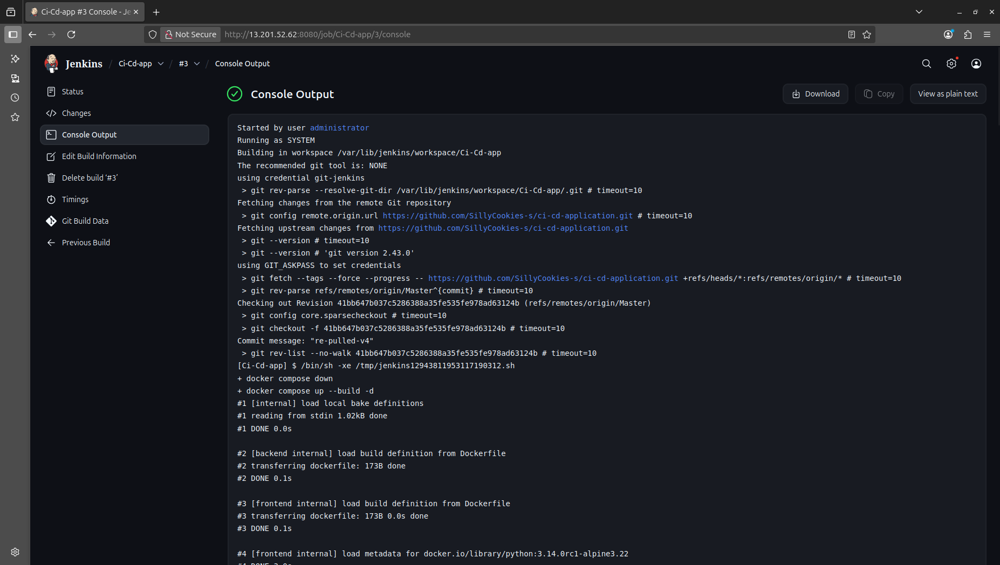
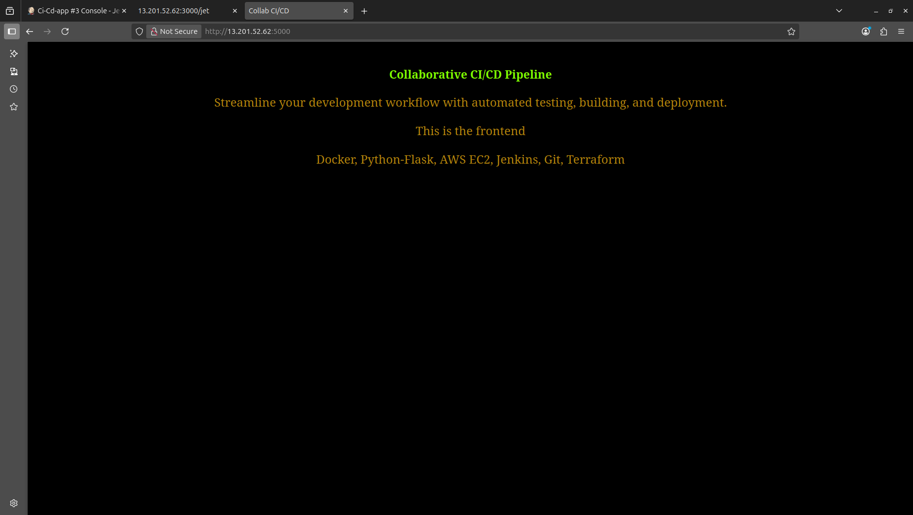
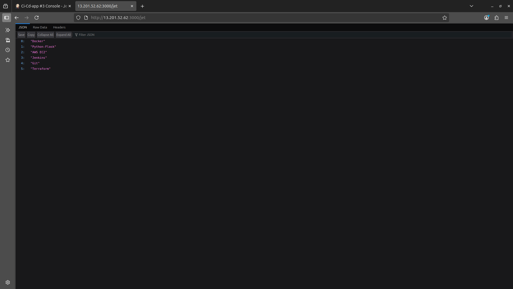
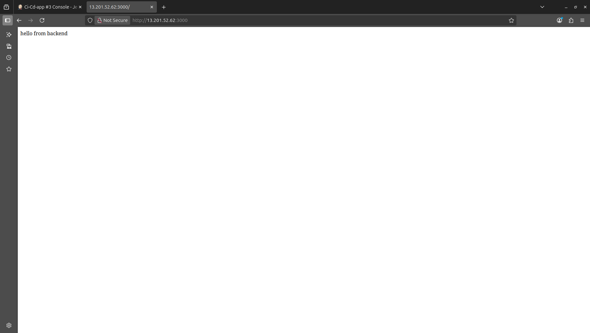

# CI/CD Application with Jenkins & Docker

A complete CI/CD pipeline demonstration using Flask applications, Docker, Jenkins, and Terraform for AWS EC2 provisioning.

## 🏗️ Architecture

### System Overview
```
┌─────────────────┐    ┌──────────────────┐    ┌─────────────────────┐
│   Developer     │    │     GitHub       │    │    AWS EC2          │
│                 │    │   Repository     │    │                     │
│  ┌───────────┐  │    │                  │    │  ┌───────────────┐  │
│  │    Code   │──┼────┤  Source Control  │    │  │    Jenkins    │  │
│  │  Changes  │  │    │                  │    │  │   CI/CD       │  │
│  └───────────┘  │    │                  │    │  │   Server      │  │
└─────────────────┘    └──────────────────┘    │  └───────┬───────┘  │
                                               │          │          │
                                               │          ▼          │
                                               │  ┌───────────────┐  │
                                               │  │    Docker     │  │
                                               │  │  Containers   │  │
                                               │  │               │  │
                                               │  │ ┌───────────┐ │  │
                                               │  │ │ Frontend  │ │  │
                                               │  │ │   :5000   │ │  │
                                               │  │ └───────────┘ │  │
                                               │  │ ┌───────────┐ │  │
                                               │  │ │ Backend   │ │  │
                                               │  │ │   :3000   │ │  │
                                               │  │ └───────────┘ │  │
                                               │  └───────────────┘  │
                                               └─────────────────────┘
```

### CI/CD Pipeline Flow
```
1. Code Push        2. Jenkins Poll     3. Build Trigger    4. Deploy
   ┌─────────┐         ┌─────────┐         ┌─────────┐        ┌─────────┐
   │git push │────────▶│ Every   │────────▶│ Pull    │───────▶│ docker  │
   │to master│         │ minute  │         │ latest  │        │ compose │
   └─────────┘         │ check   │         │ code    │        │ up      │
                       └─────────┘         └─────────┘        └─────────┘
                                                                    │
                                                                    ▼
                                                              ┌─────────┐
                                                              │ Live    │
                                                              │ Apps    │
                                                              └─────────┘
```

### Component Details
- **Frontend**: Flask web application serving HTML templates
- **Backend**: Flask API serving tools data via REST endpoints
- **Infrastructure**: Terraform for automated AWS EC2 provisioning (optional)
- **CI/CD**: Jenkins pipeline with automated deployment on code changes
- **Source Code**: [GitHub Repository](https://github.com/SillyCookies-s/devops-automation-pipeline.git) - Complete project with applications and infrastructure

### Infrastructure Options
- **Terraform (Included)**: Automated EC2 provisioning with Jenkins & Docker pre-installed
- **Existing EC2**: Deploy on your existing infrastructure with manual setup
- **Local Development**: Run directly with Docker Compose

## ⚠️ SECURITY NOTICE

**Before deployment, you MUST use your own AWS credentials:**
- Copy `terraform/variable_example.tf` to `terraform/variable.tf`
- Update `variable.tf` with your actual AWS Access Key, Secret Key, Subnet ID, VPC ID, and Key Pair name
- The original `variable.tf` is git-ignored for security

## 🚀 Quick Start

### Option 1: Local Development (Manual)
```bash
# Clone the repository
git clone https://github.com/SillyCookies-s/devops-automation-pipeline.git
cd devops-automation-pipeline

# Run with Docker Compose
cd application
docker compose up --build -d

# Access applications
# Frontend: http://localhost:5000
# Backend: http://localhost:3000
```

### Option 2: AWS Deployment with Jenkins CI/CD

**Terraform Setup (Optional but Recommended)**
```bash
# If you need a new EC2 instance with automated setup:
cd terraform

# Create terraform.tfvars with your AWS details
# (See variable_example.tf for required variables)

# Deploy infrastructure
terraform init
terraform plan
terraform apply

# Wait 10+ minutes for Jenkins & Docker installation
# Access Jenkins: http://<ec2-ip>:8080
# Get initial password: sudo cat /var/lib/jenkins/secrets/initialAdminPassword
```

**Existing EC2 Setup**
```bash
# If you already have an EC2 instance:
# 1. Install Docker, Jenkins, and Git manually
# 2. Clone this repository
# 3. Setup Jenkins CI/CD pipeline
# See DEPLOYMENT.md for detailed steps
```

## 📁 Project Structure

```
├── application/            # Main application code
│   ├── backend/            # Flask API backend
│   │   ├── app.py          # Main backend application
│   │   ├── data_example.py # Sample data
│   │   ├── Dockerfile      # Backend container config
│   │   └── requirements.txt
│   ├── frontend/           # Flask web frontend
│   │   ├── templates/      # HTML templates
│   │   ├── app.py          # Frontend application
│   │   ├── Dockerfile      # Frontend container config
│   │   ├── .env            # Environment variables
│   │   └── requirements.txt
│   └── docker-compose.yml  # Multi-container orchestration
├── terraform/              # AWS infrastructure as code
│   ├── main.tf             # Main infrastructure config
│   ├── variable_example.tf # Variable reference
│   └── ...                 # Other Terraform files
├── README.md               # This file
├── SETUP.md                # Detailed setup instructions
└── DEPLOYMENT.md           # AWS deployment guide
```

**📂 [View Application Code](application/)** - Complete Flask applications with Docker configuration

> **Note**: If clicking the application folder doesn't work, use this direct link: https://github.com/SillyCookies-s/ci-cd-application.git

## 🔄 CI/CD Pipeline Features

### Automated Deployment
- **Continuous Integration**: Jenkins monitors GitHub repository
- **Polling Frequency**: Checks for changes every minute
- **Auto-deployment**: Automatically rebuilds and deploys on code changes
- **Zero-downtime**: Uses Docker Compose for seamless updates

### Pipeline Workflow
1. **Code Push** → GitHub repository
2. **Jenkins Detection** → Polls repository every minute
3. **Build Trigger** → Downloads latest code
4. **Container Rebuild** → `docker compose up --build -d`
5. **Service Update** → Applications updated with zero downtime

## 🔧 Jenkins Configuration

### Initial Setup
1. **Access Jenkins**: `http://<ec2-ip>:8080`
2. **Get initial password**: `sudo cat /var/lib/jenkins/secrets/initialAdminPassword`
3. **Install suggested plugins**
4. **Create admin user**

### CI/CD Job Configuration
1. **Create Freestyle Project**
2. **Source Code Management**:
   - Repository: `https://github.com/SillyCookies-s/devops-automation-pipeline.git`
   - Credentials: GitHub PAT token
   - Branch: `*/Master`

3. **Build Triggers**:
   - Poll SCM: `* * * * *` (every minute)
   - GitHub hook trigger (optional)

4. **Build Steps**:
   ```bash
   cd application
   docker compose down || true
   docker compose up --build -d
   ```

### Suggested Post-Build Actions
- **Publish Test Results**: If you add tests
- **Email Notifications**: On build failure/success
- **Slack Integration**: Team notifications
- **Build Status Badge**: For README

### Alternative: Pipeline as Code
For advanced users, a `Jenkinsfile` is included in the application directory for Pipeline projects:

**Current Jenkinsfile Configuration:**
- **Repository**: `https://github.com/SillyCookies-s/ci-cd-application.git`
- **Branch**: `Master`
- **Credentials**: `SillyCookies-s/**************************` (masked)
- **Polling**: Every minute (`* * * * *`)
- **Webhook**: GitHub push integration
- **Deployment**: Automated Docker Compose rebuild

**Setup Requirements:**
1. **Create Pipeline Job** (instead of Freestyle)
2. **Add GitHub PAT Token** to Jenkins credentials with ID: `github-pat-token`
3. **Point Pipeline to Repository** - Jenkins will auto-detect the Jenkinsfile

**Features:**
- Automated polling every minute
- GitHub webhook integration
- Infrastructure as Code approach
- Version-controlled pipeline configuration

## 🛠️ Technologies Used

- **Frontend**        : Flask, HTML, CSS, JavaScript
- **Backend**         : Flask, Python, CORS
- **Containerization**: Docker, Docker Compose
- **CI/CD**           : Jenkins (Freestyle Project)
- **Infrastructure**  : Terraform, AWS EC2
- **Version Control** : Git, GitHub
- **Monitoring**      : Jenkins Build History

## 📋 Prerequisites

### For Local Development
- Docker & Docker Compose
- Python 
- Git

### For AWS Deployment
- AWS Account with programmatic access
- Terraform installed
- SSH key pair for EC2 access
- GitHub Personal Access Token

## 🔍 API Endpoints

- `GET /`    - Backend health check
- `GET /jet` - Returns list of tools/technologies used

## 🎯 Features

- ✅ **Automated CI/CD Pipeline**      - Jenkins monitors and deploys changes
- ✅ **Containerized Microservices**   - Docker containers for each service
- ✅ **Infrastructure as Code**        - Terraform for AWS provisioning
- ✅ **Zero-downtime Deployment**      - Docker Compose rolling updates
- ✅ **Cross-origin Resource Sharing** - CORS enabled for API access
- ✅ **Environment Configuration**     - .env file support
- ✅ **Production-ready Setup**        - AWS EC2 with security groups

## 📝 Important Notes

### Deployment Timeline
- **Terraform Apply**              : 2-3 minutes
- **Jenkins & Docker Installation**: 10-15 minutes
- **First Build**                  : 2-3 minutes
- **Subsequent Builds**            : 30-60 seconds

### Service Management
- **Jenkins**     : May require restart after initial deployment
- **Docker**      : Automatically starts on boot
- **Applications**: Auto-restart on container failure

### Security
- Update default Jenkins password immediately
- Configure proper AWS security groups
- Use HTTPS in production environments
- Regularly update dependencies

## 🔍 Monitoring & Verification

### Application Health
- Frontend: `http://<ec2-ip>:5000`
- Backend : `http://<ec2-ip>:3000`
- API     : `http://<ec2-ip>:3000/jet`

### Jenkins Monitoring
- Build History : Jenkins Dashboard
- Console Output: Job logs
- SCM Polling   : Repository change detection

## 🤝 Contributing

1. Fork the repository
2. Create feature branch (`git checkout -b feature/amazing-feature`)
3. Commit changes (`git commit -m 'Add amazing feature'`)
4. Push to branch (`git push origin feature/amazing-feature`)
5. Open Pull Request
6. Jenkins will automatically test and deploy approved changes

## 📄 License

This project is open source and available under the [MIT License](LICENSE).

## 📸 Screenshots

### AWS Infrastructure

*EC2 instance with matching IP address*

### Jenkins CI/CD Pipeline

*Jenkins console output - build start*


*Jenkins console output - successful deployment*


*Jenkins polling log after Git changes*

### Live Applications - Before Git Change

*Frontend at `<ec2-ip>:5000` before code changes*


*Backend API at `<ec2-ip>:3000/jet` before changes*

### Live Applications - After Git Change

*Frontend at `<ec2-ip>:5000` after code changes*


*Backend API at `<ec2-ip>:3000/jet` after changes*


*Backend health check endpoint*

## 🆘 Support

- **Documentation**: Check SETUP.md and DEPLOYMENT.md
- **Issues**: Create GitHub issues for bugs/features
- **Jenkins Logs**: `/var/log/jenkins/jenkins.log`
- **Application Logs**: `docker compose logs -f`