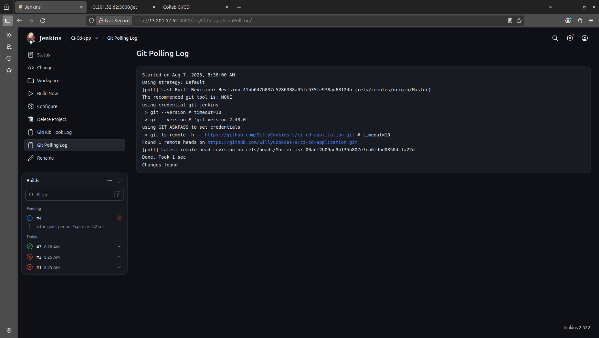
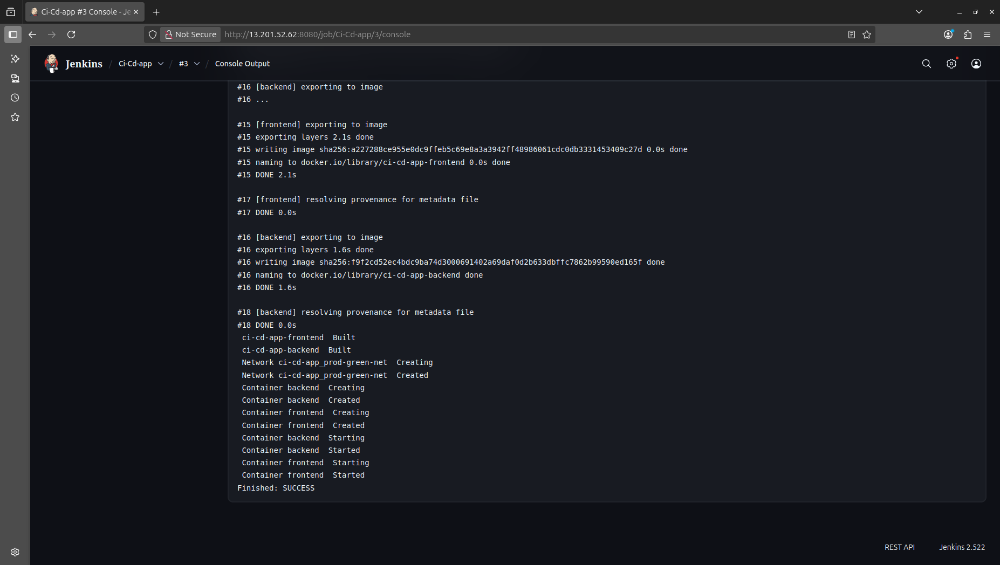

# Setup Instructions

## 🔧 Local Development

### Prerequisites
- Docker & Docker Compose
- Python 3.x
- Git

### Steps
1. **Clone Repository**
   ```bash
   git clone https://github.com/SillyCookies-s/ci-cd-application.git
   cd ci-cd-application
   ```

2. **Run Application**
   ```bash
   cd application
   docker compose up --build -d
   ```

3. **Verify Deployment**
   - Frontend: http://localhost:5000
   - Backend: http://localhost:3000
   - API: http://localhost:3000/jet
   


## ☁️ AWS Deployment

### Prerequisites
- AWS Account with programmatic access
- Terraform installed
- SSH key pair for EC2 access
- GitHub Personal Access Token

### Terraform Setup
1. **Configure AWS Credentials**
   ```bash
   aws configure
   ```

2. **Setup Variables**
   ```bash
   cd terraform
   cp variable_example.tf variable.tf
   # Edit variable.tf with your AWS credentials
   # Note: .tfstate and .tfvars files are auto-generated by terraform
   ```

3. **Deploy Infrastructure**
   ```bash
   terraform init  # Auto-generates .terraform/ and .terraform.lock.hcl
   terraform plan  # Auto-generates plan files
   terraform apply # Auto-generates .tfstate files
   ```

4. **Wait 10-15 minutes** for Jenkins & Docker installation

### Jenkins Configuration
1. **Access Jenkins**: `http://<ec2-ip>:8080`
   
   
   *Jenkins polling log showing Git change detection*

2. **Get password**: `sudo cat /var/lib/jenkins/secrets/initialAdminPassword`
3. **Create Freestyle Project**
4. **Configure Git**: Repository URL + GitHub PAT token
5. **Build Triggers**: Poll SCM `* * * * *`
6. **Build Steps**:
   ```bash
   cd application
   docker compose down || true
   docker compose up --build -d
   ```
   
   
   *Console output of successful deployment*

## 🐛 Troubleshooting

### Common Issues
- **Jenkins not starting**: `sudo systemctl restart jenkins`
- **Docker permissions**: `sudo usermod -aG docker jenkins`
- **Port access**: Check AWS Security Groups

### Verification
```bash
# Check services
sudo systemctl status jenkins docker

# Check containers
docker compose ps

# Test applications
curl http://localhost:3000/jet
```